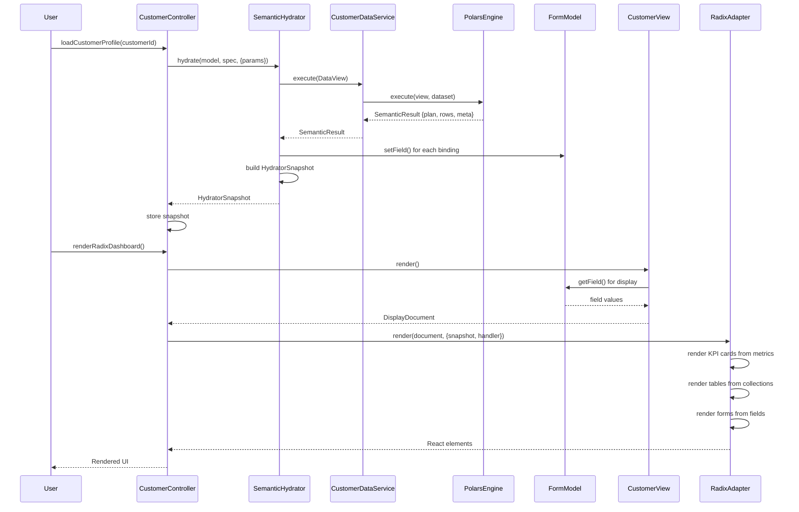

# Model System Architecture

## Overview

The Model system is an EDA (Exploratory Data Analysis) toolkit that combines semantic data modeling with MVC form architecture, creating a foundation for FormApp development.

## Architecture Diagram

```mermaid
graph TB
    subgraph "Semantic Layer (SDSL)"
        DM[DataModel<br/>CustomerModel<br/>- fields<br/>- measures<br/>- dimensions<br/>- joins]
        DV[DataView<br/>Query Builder<br/>- filter<br/>- aggregate<br/>- group_by]
        DM -->|view query| DV
    end

    subgraph "Execution Layer"
        DS[SemanticDataService<br/>CustomerDataService]
        PE[PolarsExecutionEngine<br/>Arrow/DataFrame]
        SQL[SqlEngine<br/>SQL Generation]
        DS -->|execute| PE
        DS -.->|optional| SQL
        DV -->|executes| DS
    end

    subgraph "Hydration Bridge"
        SH[SemanticHydrator]
        HS[HydratorSnapshot<br/>- plan<br/>- rows<br/>- metrics<br/>- collections]
        SH -->|produces| HS
        DS -->|SemanticResult| SH
    end

    subgraph "MVC Layer"
        subgraph "Controller"
            CC[CustomerController<br/>extends ReactController]
            BL[Business Logic<br/>- submit<br/>- delete<br/>- getInvoices]
            CC --> BL
        end

        subgraph "Model"
            FM[FormModel<br/>FormShape State]
            FS[FormShape<br/>Field Definitions]
            FS --> FM
        end

        subgraph "View"
            CV[CustomerView<br/>extends ReactView]
            DD[DisplayDocument<br/>- layout<br/>- elements<br/>- meta]
            CV -->|renders| DD
        end

        CC -->|manages| FM
        CC -->|creates| CV
        CV -->|reads| FM
    end

    subgraph "Adapter Layer"
        RA[RadixAdapter<br/>Shadcn Components]
        RP[RadixPrimitives<br/>Card, Table, Metric]
        RA -->|uses| RP
        DD -->|adapts| RA
        HS -->|provides data| RA
    end

    subgraph "Data Sources"
        MOCK[Mock Data<br/>Customer[]<br/>Invoice[]]
        ARROW[Arrow Buffers<br/>Polars DataFrame]
        MOCK -->|builds| DS
        PE -->|produces| ARROW
    end

    %% Flow connections
    CC -->|loadCustomerProfile| SH
    SH -->|hydrates| FM
    SH -->|stores| HS
    CC -->|accesses| HS
    CC -->|renderRadixDashboard| RA
    RA -->|renders| UI[React UI<br/>KPI Cards<br/>Tables<br/>Forms]

    %% Styling
    classDef semantic fill:#e1f5ff,stroke:#01579b,stroke-width:2px
    classDef execution fill:#f3e5f5,stroke:#4a148c,stroke-width:2px
    classDef hydration fill:#fff3e0,stroke:#e65100,stroke-width:2px
    classDef mvc fill:#e8f5e9,stroke:#1b5e20,stroke-width:2px
    classDef adapter fill:#fce4ec,stroke:#880e4f,stroke-width:2px
    classDef data fill:#f1f8e9,stroke:#33691e,stroke-width:2px

    class DM,DV semantic
    class DS,PE,SQL execution
    class SH,HS hydration
    class CC,BL,FM,FS,CV,DD mvc
    class RA,RP,UI adapter
    class MOCK,ARROW data
```

## Data Flow Sequence



## Component Responsibilities

### Semantic Layer (SDSL)
- **DataModel**: Defines business entities with measures, dimensions, and relationships
- **DataView**: Query builder for filtering, aggregating, and grouping
- **Purpose**: Declarative data modeling (Malloy-style)

### Execution Layer
- **SemanticDataService**: Interface for executing DataViews
- **PolarsExecutionEngine**: Executes views using Polars/Arrow
- **SqlEngine**: Generates SQL from views (optional)
- **Purpose**: Execute semantic queries efficiently

### Hydration Bridge
- **SemanticHydrator**: Maps semantic results to form state
- **HydratorSpec**: Declarative mapping configuration
- **HydratorSnapshot**: Immutable result bundle
- **Purpose**: Bridge semantic layer to MVC form state

### MVC Layer
- **Controller**: Orchestrates data loading, business logic, and rendering
- **FormModel**: Manages form state and field values
- **FormView**: Renders DisplayDocument from model state
- **Purpose**: Traditional MVC pattern for form applications

### Adapter Layer
- **RadixAdapter**: Renders DisplayDocument as React components
- **RadixPrimitives**: Reusable UI components (Card, Table, Metric)
- **Purpose**: Convert abstract display language to concrete UI

## Key Concepts

### HydratorSpec
Defines how semantic query results map to form fields:
```typescript
{
  id: 'customer-profile',
  view: ({ params }) => CustomerModel.view({ filter: { id: params.customerId } }),
  fields: [{ fieldId: 'name', source: 'name' }],
  collections: [{ id: 'invoices', source: 'invoices', fieldId: 'invoices' }],
  metrics: [{ name: 'totalRevenue', source: 'metrics.totalRevenue', fieldId: 'totalRevenue' }]
}
```

### HydratorSnapshot
Immutable bundle containing:
- `plan`: Execution plan (for debugging)
- `rows`: Raw query results
- `metrics`: Computed KPIs
- `collections`: Related data arrays
- `assignedFields`: Fields that were populated

### DisplayDocument
Abstract representation of UI:
- `layout`: Structure (stack, grid, etc.)
- `children`: Nested elements
- `meta`: Additional metadata

## FormApp Pattern

This architecture enables FormApp development:

1. **Define Semantic Model**: Create DataModel with measures/dimensions
2. **Create HydratorSpec**: Map semantic results to form fields
3. **Build Controller**: Extend ReactController, integrate hydrator
4. **Customize View**: Extend ReactView for domain-specific layouts
5. **Render with Adapter**: Use RadixAdapter for modern UI components

The result is a form application that:
- ✅ Loads data from semantic queries
- ✅ Displays KPIs and metrics automatically
- ✅ Shows related collections (tables, lists)
- ✅ Handles form validation and submission
- ✅ Provides execution observability (plans)

